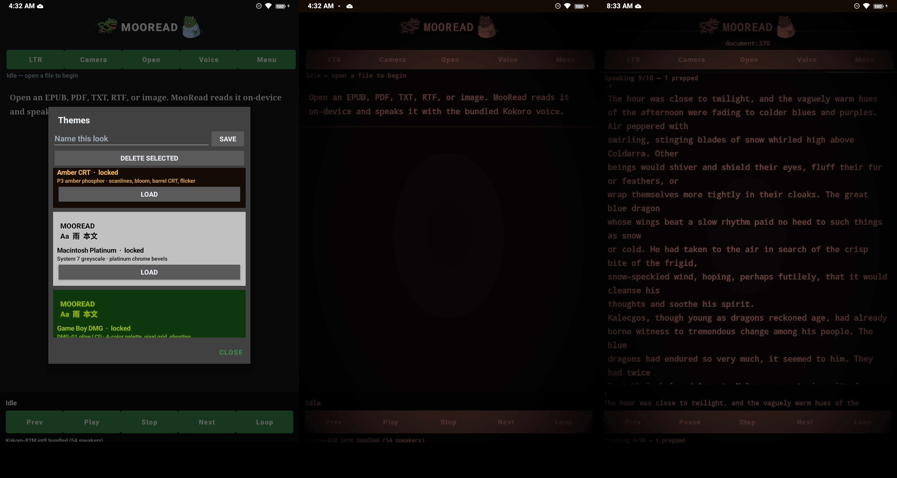

# MooRead

Offline document reader that speaks with bundled Kokoro TTS.

**Live Android tree is `MooReadAndroid/`. Desktop tree is `MooRead/`.**



Amber CRT keeps phosphor, scanlines, and flicker. Barrel / curved-screen warp was removed so buttons stay hittable. Book files are not in this repo.

## What it does

### Reading
- Open EPUB, PDF, TXT, RTF, or an image
- Camera still → on-device OCR → speak the page
- PDF uses the embedded text layer first; scanned pages fall back to OCR one page at a time
- Does not slurp a whole long PDF into memory before speech starts
- Chunks text into spoken blocks (~sentence/paragraph size)
- Reader view with LTR / RTL toggle
- Custom TTF/OTF font picker
- Optional JA→EN translation toggle (does not replace Japanese TTS)
- Desktop also opens a folder, a manga/image folder, or a photo import

### Voice (all on-device)
- Kokoro-82M neural TTS — no cloud, no system SAPI for the main path
- Android: sherpa-onnx multi-lang pack (English + Japanese `jf_alpha` and the rest of the multi-lang table)
- Desktop: kokoro-onnx `kokoro-v1.0.int8.onnx` + `voices-v1.0.bin`
- Built-in profiles: Bella storyteller, Nicole documentary, Michael lecture, George British, Alpha Japanese
- Import extra JSON voice profiles (rate, pitch, locale, lexicon)
- Auto-routes Japanese text to a `jf_` / `jm_` speaker
- Play / Pause / Stop / Prev / Next
- Loop **speech** (whole file again) — separate from video-wallpaper looping
- Prefetches about five spoken blocks ahead so the voice does not stall on each section
- Foreground playback service on Android so it can keep talking with the screen off
- Status line shows block index and how many blocks are already prepped

### Themes (whole app, not just a color swap)
- **Amber CRT** — phosphor, scanlines, flicker, vignette (no barrel bend)
- **Macintosh Platinum** — System 7 greyscale / chrome bevels
- **Game Boy DMG** — 4-color olive LCD + pixel grid
- AGSL `RuntimeShader` on Android 13+ over the whole content root; ColorMatrix + overlay fallback on older devices
- Same look language on desktop (`theme_fx.py`)
- Save / load / delete custom color themes
- Unload theme → default dark look, shader off
- Reset settings clears colors, shader, wallpaper, tilt, and translucency

### Backgrounds
- Dedicated Background menu (not mixed into random settings)
- Image or video wallpaper behind the book
- Video backgrounds **loop** until you change or clear them (not a one-shot play)
- Wallpaper Engine pack / `project.json` import (preview of the packaged media)
- Fit: stretch, contain, cover, center
- Translucency slider: fully opaque down to 95% see-through (5% wallpaper left)
- Mute / unmute wallpaper audio
- Gyro tilt parallax + aggressiveness slider
- Clear background

### Platforms
- Android app (`MooReadAndroid/`)
- Windows + Linux desktop (`MooRead/`, Tk UI, Wayland and Xorg via the toolkit)
- Same document + voice + theme idea on both; Android has camera / gyro / foreground service

## Voice models (not in git)

See **[VOICE_MODELS.md](VOICE_MODELS.md)**.

- Desktop → [kokoro-onnx model-files-v1.0](https://github.com/thewh1teagle/kokoro-onnx/releases/tag/model-files-v1.0)
- Android → [sherpa kokoro-multi-lang-v1_0](https://github.com/k2-fsa/sherpa-onnx/releases/download/tts-models/kokoro-multi-lang-v1_0.tar.bz2)

Do **not** copy Windows `voices-v1.0.bin` onto the APK.

## Build

```
cd MooReadAndroid
./gradlew :app:assembleDebug
# sign the APK before install

cd MooRead
python -m pip install -r requirements.txt
python run.py
```
